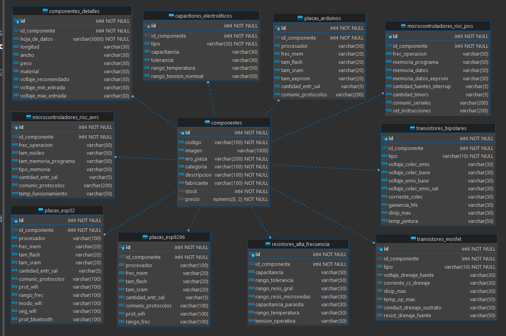

# Base de Datos Dispositivos Electrónicos | PostgreSQL
Base de Datos acerca de Dispositivos Electrónicos, tales como transistores, capacitores, resistores de alta frecuencia, etc.

* [Sitio web ejemplificación](http://gmelectronicaweb.com/catalogo/pag108.html)
* [Repositorio db migrado (Oracle --> PostgreSQL)](https://github.com/andresWeitzel/db_microelectronica_Oracle)
* [ApiRest_Dispositivos_Electronicos_ExpressJS](https://github.com/andresWeitzel/ApiRest_Dispositivos_Electronicos_ExpressJS)

 

## Índice 📜

 
 Ver 

 
  
 
### Sección 1) Descripción, Tecnologías y Ejecución

 - [1.0) Descripción del Proyecto.](#10-descripción-)
 - [1.1) Ejecución del Proyecto.](#11-ejecución-del-proyecto-)
 - [1.2) Tecnologías.](#12-tecnologías-)

### Sección 2) Prueba de Funcionalidad y Referencias
 
 - [2.0) Prueba de Funcionalidad.](#20-prueba-de-funcionalidad-)
 - [2.1) Referencias.](#21-referencias-)

 

 

## Sección 1) Descripción, Tecnologías y Ejecución 

### 1.0) Descripción [🔝](#índice-) 

  
Ver

 
  
 
## Descripción Técnica

* Se Jerarquiza la información según las categorías de diferentes componentes electrónicos y a su vez sus especificaciones técnicas más relevantes.
* El Proyecto (dbeaver) está organizado y modularizado para que cualquier cambio se pueda efectuar de forma eficaz y eficiente
* La Base de Datos describen de forma específica dichos componentes por categoría. Hay componentes que entran en la categoría de Transistores, otros de Capacitores, Resistores, etc.
* Hay tablas que pueden especificar aún más la categoría del componente. Como por ejemplo el componente transistor, los transistores pueden ser de tipo BJT, MOSFET, ETC. Si se crea solamente una tabla por categoría no sería una db normalizada, ya que habría campos que no serían completados porque, en el caso de los transistores, un tipo BJT no tiene las mismas características/parámetros que un MOSFET, este ejemplo aplica para el otros tipos de componentes de la db.
* Se analizó la posibilidad de solamente implementar características genéricas ya que las especificaciones técnicas de todo tipo de componente están indexadas dentro de un datasheet que el fabricante provee, pero teniendo en consideración que esta es una base de datos que puede aplicar como modelo de una real para fabricantes, se toma dichas consideraciones y se agrega un campo para almacenar la hoja de datos del componente y se normaliza con tablas según las categorías de los mismos.
* En esta [Página de Ejemplo](http://gmelectronicaweb.com/catalogo/pag108.html) podemos visualizar que se proyectan los datos más relevantes de los componentes sin necesidad de implementar una hoja de datos completa.
* Para las Especificaciones de los Transistores me base en la página https://alltransistors.com/es/mosfet/transistor.php?transistor=4 
* Para las Especificaciones de los capacitores y Resistores me base en la página https://ar.mouser.com/c/ds/passive-components/capacitors/aluminum-electrolytic-capacitors/
* Especificaciones de los pics https://www.kynix.com/Detail/10386/PIC18F4520-I%2FPT.html?gclid=Cj0KCQiAxc6PBhCEARIsAH8Hff0_9CtuRscm1qf3-50qS1D_lP8jdspHgQRWw904hpn6nC1sXRh4JnQaAlpxEALw_wcB
* Especificaciones de Arduino https://docs.arduino.cc/resources/datasheets/A000066-datasheet.pdf
* Especificaciones de los Esp8266 https://cdn-shop.adafruit.com/product-files/2471/0A-ESP8266__Datasheet__EN_v4.3.pdf
* Algunos Valores de los Registros Insertados no son completamente verídicos, se prioriza el desarrollo ágil en relación a la información almacenada (los valores pueden ser modificados rápidamente, el desarrollo de la db no ).
* La Base de Datos puede ser Escalable siguiendo el mismo patrón de Normalización del Proyecto, solo se realizaron 10 tablas a modo de aplicación práctica y se modulariza en DDL, DML(INSERTS, UPDATES, DELETES) y QUERIES.

 

### Diagrama Entidad Relación  `db_microelectronica`

 

### 1.1) Ejecución del Proyecto [🔝](#índice-)

  
Ver

  
    
  
* Descargar postgreSQL
* Descargar DBeaver
* Abrir DBeaver --> Archivo --> Incorporar proyecto del sistema de archivo
* Desplegar pestaña del proyecto y ejecutar los Scripts (DLL,DML,ETC).
* Si se desea ejecutar desde pgAdmin creamos una db con el nombre `db_dispositivos_electronicos` y ejecutamos los scripts según el orden numerado desde el editor sql
 

### 1.2) Tecnologías [🔝](#índice-)

  
Ver

 
  
	
 

 

 

## Sección 2) Prueba de Funcionalidad y Referencias

### 2.0) Prueba de Funcionalidad [🔝](#índice-)

 
Ver

#### Tabla `componentes`

#### Tabla `componentes_detalles`

#### Tabla `componentes_transistores_bipolares`

* Se acota doc gráfica. Visualizar el resto de las funcionalidades.

 

### 2.1) Referencias [🔝](#índice-)

 
Ver

#### Documentación
* [Documentación postgreSQL](https://www.postgresqltutorial.com/postgresql-administration/postgresql-create-database/)

 

